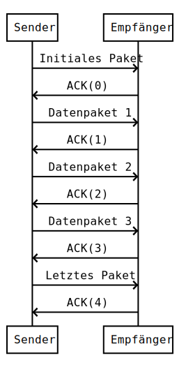

# Dokumentation für NodeJS

## Code Location

Der Code befindet sich in der Datei [/TX/NodeJS/main.js](/TX/NodeJS/main.js)

## Voraussetzungen für die Ausführung

- NodeJS installiert (https://nodejs.org/de/download/)
- Falls beim ausführen des TX eine Fehlermeldung kommt, dass ein Modul nicht gefunden wurde, einmal `npm install` im Ordner des JS TX ausführen. (Sollte nicht passieren, da nur Standardmodule verwendet werden)

## Ausführen

    node main.js --help
     oder
    node . --help

## Optionen

    -h, --host, <host>      Host to send to (default: 127.0.0.1)
    -p, --port <port>       Port to send to (default: 12345)
    -m, --max <size>        Maximum packet size (default: 1472)
    -V, --version           TX Version to use (default: 3)
    -n, --sliding-window    Sliding Windows size (Only applicable if version = 3, default 10)
    -f, --file <filename>   File to send (default: test.txt)
    -q, --quiet             Suppress log output (overrides -v)
    -v, --verbose           Verbose log output
    -?, --help              Show this help
    -t, --timeout           Timeout for acks (Only applicable if version = 3,default: 1000ms)

>QoL: 
>- Host nimmt auch Parameter der Form `host:port` an
>- Falls `-h` ohne Parameter aufgerufen wird, wird davon ausgegangen, dass `-?` gemeint war und die Hilfe ausgegeben 

## Packettypen

Es gibt 3 verschiedene Packettypen:
- Initiales Paket
    - Transmission ID (16 Bit)
    - Sequence Number (32 Bit)
    - Max Sequence Number (32 Bit)
    - File Name (8..2048 Bit)
- Datenpaket
    - Transmission ID (16 Bit)
    - Sequence Number (32 Bit)
    - Data (..)
- Letztes Paket
    - Transmission ID (16 Bit)
    - Sequence Number (32 Bit)
    - MD5 (128 Bit)

## Versionen

Der Sender kann in drei Versionen betrieben werden.

- Version 1: Sender sendet alle Pakete ohne auf eine Antwort zu warten


- Version 2: Sender sendet ein Paket und wartet auf eine Antwort, bevor er das nächste Paket sendet
    - Der Sender hat kein Timeouts
    - Es wird auf ein ACK für die gesendete Sequenznummer gewartet



- Version 3: Sender sendet ein Window an Paketen und wartet auf eine Cumulative Acknowledgement, bevor er das nächste Window sendet. Ein dupliziertes Acknowledgement wird als verlorenes Paket interpretiert und das Paket wird erneut gesendet.
    - Für das Initialisierungspaket wird ein Timeout verwendet (default: 1000ms). Grund: Sicherstellen, dass der Empfänger bereit ist, bevor Daten gesendet werden.
    - Sonst hat der Sender kein Timeouts
    - CumACK: Sequence Number des letzten Pakets des Windows
    - DupACK: Sequence Number des Pakets - 1, das verloren gegangen ist \
    Grund: Wenn ein ACK für die Sequence Number des letzten Pakets des Windows doppelt gesendet wird um anzuzeigen, dass das letzte Paket des Windows verloren gegangen ist, geht der Sender davon aus, dass das Window erfolgreich gesendet wurde.


## Funktionsweise des Senders

Am Anfang werden alle Variablen initialisiert und gegebenenfalls von den Parameter aus der Kommandozeile überschrieben.

Danach wird der Socket geöffnet `const socket = dgram.createSocket('udp4')` und die Methode `sendFile(FILE)` aufgerufen.

Darin wird das File in einen Buffer geladen und maxSequenceNumber md5 berechnet.

Im Fall von Version 1 und 2 werden die Pakete incrementell gesendet und auf ein ACK gewartet. Das warten auf ein ACK wird durch die Methode `waitForAckPacket(id, seqNum)` realisiert.\
Hierbei gibt die Methode ein Promise zurück, welches aufgelöst wird, wenn ein ACK für das Paket mit der Sequence Number `seqNum` und der Transmission ID `id` empfangen wird. \
Genau genommen wird ein `new Promise` erstellt, in welchem wiederum eine Methode (`messageHandler(msg)`) erstellt, welche den Inhalt der ankommenden Nachricht (`msg`) überprüft und das Promise auflöst, falls es sich um ein ACK für das gesuchte Paket handelt. \
Dieses Methode wird als Callback für den Event `message` des Sockets registriert. (`socket.on('message', messageHandler)`)

```javascript
return new Promise((resolve) => {
    function messageHandler(msg) {
      const receivedTransmissionId = msg.readUInt16BE(0);
      const receivedSequenceNumber = msg.readUInt32BE(2);
      if (receivedTransmissionId === transmissionId && receivedSequenceNumber === sequenceNumber) {
        socket.off('message', messageHandler);
        resolve();
      }
    }
    socket.on('message', messageHandler);
});
```
Im Fall von Version 1 wird als ACK einfach ein Promise zurückgegeben, das automatisch aufgelöst wird. (in JS reicht dafür ein einfaches `return;`, das empty Promise erzeugt JS automatisch)

Über das Senden von Packeten:
- Für das Initialisierungspaket: `sendfirstPacket(id, maxSeqNum, fileName)`
- Für Datenpakete: `sendPacket(id, seqNum, data)`
- Für das letzte Paket: `sendLastPacket(id, seqNum, md5)`\
Die logik ist im Enddefekt immer gleich: \
- neunen Buffer (unsafe) erstellen\
Unsafe deshalb weil schneller und wir alle Bytes beschreiben werden, also kein Problem mit alten Daten im Buffer
- Daten in Buffer schreiben\
JS gibt uns dafür die Methode `Buffer.writeXXX`, XXX steht für den Datentyp, z.B. `UInt16BE` ("Unsigned Integer 16 Bit Big Endian") oder `UInt32BE` ("Unsigned Integer 32 Bit Big Endian"). Damit wüssen wir uns keine Gedanken über die Byteorder machen, oder ob wir die richtige Anzahl an Bytes an der richtigen Stelle schreiben.\
Was wir beachten müssen ist die der Offset, also die Stelle im Buffer, an der wir anfangen zu schreiben. (`buffer.writeUInt16BE(id, 0)`)
- Buffer senden\
Wenn wir Daten senden, wissen wir per se nicht wie viele Bytes wir senden werden, hierfür hilft uns aber die Methode `socket.send` die uns erlaubt mehrere Buffer zu senden. (`socket.send([buffer, data], PORT, HOST)`) Damit kopieren wir auch nicht unnötig Daten.
- Beim Senden übergeben wir auch eine Callback Funktion, damit wir im Log ausgeben können, ob ein Paket erfolgreich vergesendet wurde oder nicht.

Im Fall von Version 3 wir zu beginn der Übertragung eine Methode rekursiv aufgerufen, bis wir ein Ack für das Initialisierungspaket erhalten. Das `waitForAckPacket` wird hierfür mit einem Timeout versehen, das das Promise nach Ablauf des Timeouts rejected.

```javascript
async function sendFirst(){
    await sendfirstPacket(id, maxSeqNum, fileName);
    await waitForAckPacket(id, 0).catch(async () => {
        await sendFirst();
  });
}
await sendFirst();
```
> Hinweis:
> - `catch` erkennen wenn das Promise rejected wurde. Falls wir erkennen wollen, ob das Promise resolved wurde, können wir `then` verwenden.
> - Die Funktion baut einen Callstack auf, sollte aber in der Praxis nicht zu einem Problem führen, da wir nicht davon ausgehen, dass die Initialisierungspakete sehr oft in Folge verloren gehen.

Danach wird solage ein Window an Paketen gesendet, bis wir das ganze Paket gesendet haben.
> Hinweis: Das letzte Paket wird als teil eines Windows gesendet, das Initialisierungspaket nicht.

Bevor das erste Paket gesendet wird, wird ein neues empty Set (`possibleDupAck`) erstellt, indem alle Angekommenen ACKs gespeichert werden.\
Dann wird eine Funktion definiert die, die Paralel zum Senden der Pakete läuft und auf ACKs wartet.\
Sobald ein neues ACK empfangen wird, wird geprüft ob es sich um ein DupACK handelt, indem im Set nach der Sequence Number gesucht wird. Falls die Sequence Number im Set ist wird das ACK als DupACK interpretiert und das Paket erneut gesendet und die Sequence Number aus dem Set entfernt. Wenn das ACK nicht im Set vorhanden ist, wird es hinzugefügt.
Diese Funktion wird als Callback für den Event `message` des Sockets registriert. (`socket.on('message', messageHandler)`)

```javascript
let possibleDupAck = new Set();
async function msgHandler(msg) {
    const receivedTransmissionId = msg.readUInt16BE(0);
    const receivedSequenceNumber = msg.readUInt32BE(2);
    if (receivedTransmissionId === id) {
        if (possibleDupAck.has(receivedSequenceNumber)) {
            possibleDupAck.delete(receivedSequenceNumber);
            const sendeSeqNum = receivedSequenceNumber + 1;
            if(sendeSeqNum < maxSeqNum)
                sendPacket(id , sendeSeqNum, data.subarray((sendeSeqNum-1)*(MAX_PACKET_SIZE-6), Math.min( sendeSeqNum*(MAX_PACKET_SIZE-6), fileSize)));
            else
                sendLastPacket(id , sendeSeqNum, md5sum);
        } else
            possibleDupAck.add(receivedSequenceNumber);
    }
}
socket.on('message', msgHandler);
```
> Hinweis: Wie man in dem Code ausschnitt sieht, wir von dem Buffer der die Datei enthält nur ein Teil übergeben. Die berechnung des Teils sieht etwas komplizierter aus als es ist, deshalb hier eine Erklärung:\
`Buffer.subarray(start inklusive, ende exklusive)`\
>- Anfang des Teils: `(sendeSeqNum-1)*(MAX_PACKET_SIZE-6)`\
`MAX_PACKET_SIZE-6` weil wir 6 Bytes für die "Header" brauchen.\
`sedeSeqNum-1` weil wir das Ende des letzten Pakets brauchen und jedes Paket `MAX_PACKET_SIZE-6` Bytes groß ist. Somit können wir mit der Sequence Number die Anzahl der Bytes berechnen die wir schon gesendet haben.
>- Ende des Teils: `Math.min(sendeSeqNum*(MAX_PACKET_SIZE-6), fileSize)`\
`sendeSeqNum*(MAX_PACKET_SIZE-6)` selbe begründung wie oben nur für das Ende des aktuellen Pakets.\
`Math.min()` weil das letzte Paket kleiner als `MAX_PACKET_SIZE-6` sein kann und wir nicht mehr Daten senden können als wir haben.\
Da der Start inklusive und das Ende exklusive ist, müssen wir uns nicht mit +1 oder -1 rumärgern.
