# Messungen

| TX/RX | &nbsp;&nbsp;&nbsp;Java&nbsp;&nbsp;&nbsp; | Python |
:-------------------------:|:-------------------------:|:-------------------------:
| Dart | 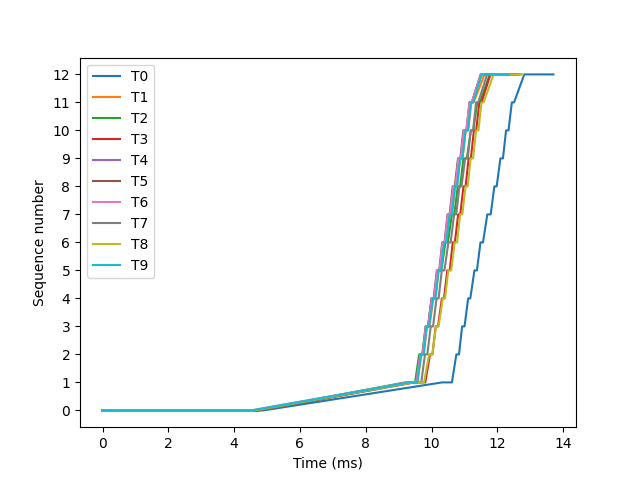 0.1 - 0.1 MB/s 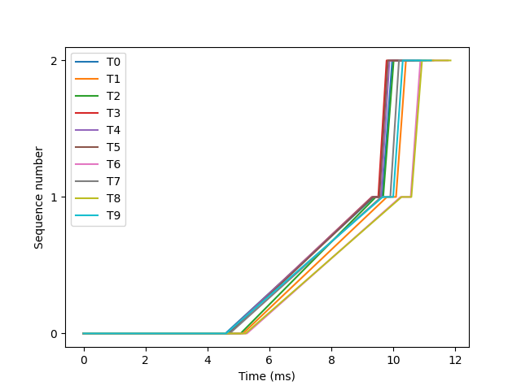 0.1 - 0.1 MB/s 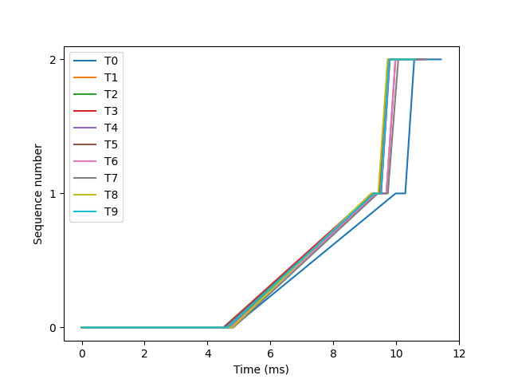 0.1 - 0.1 MB/s | 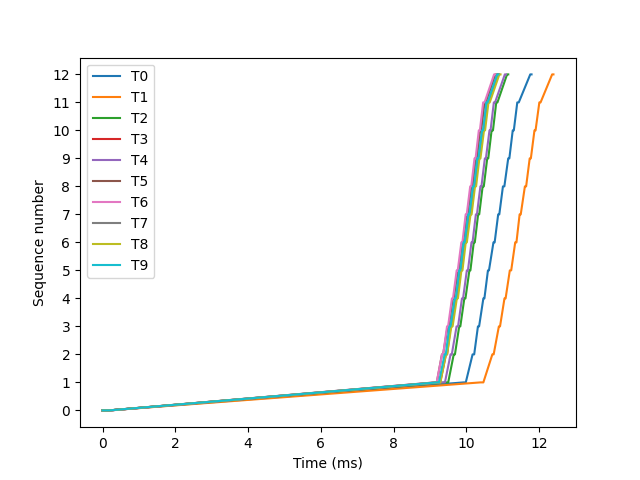 0.1 - 0.1 MB/s 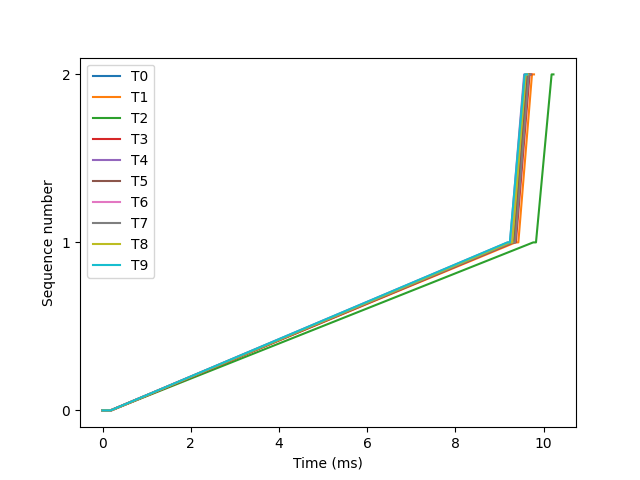 0.1 - 0.1 MB/s 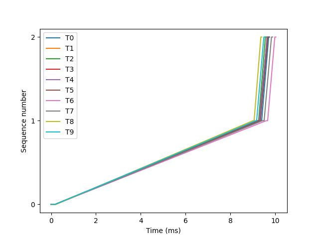 0.1 - 0.1 MB/s |
| Node | 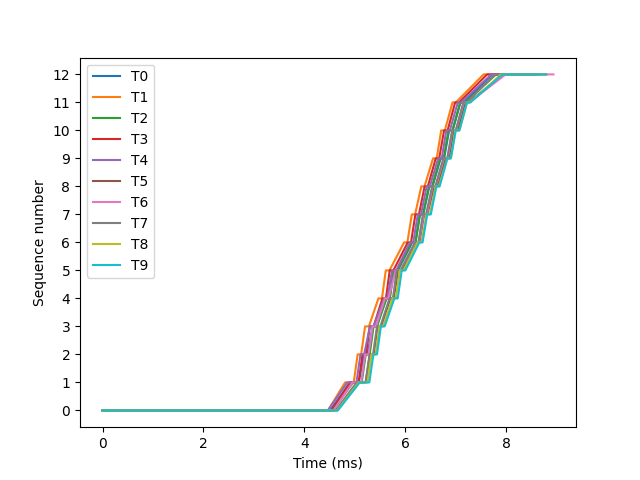 0.1 - 0.1 MB/s 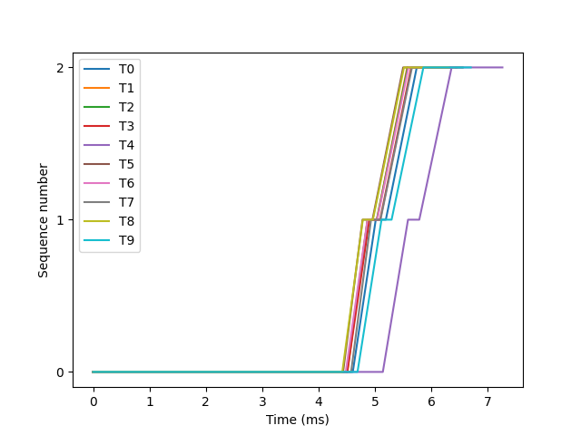 0.1 - 0.2 MB/s 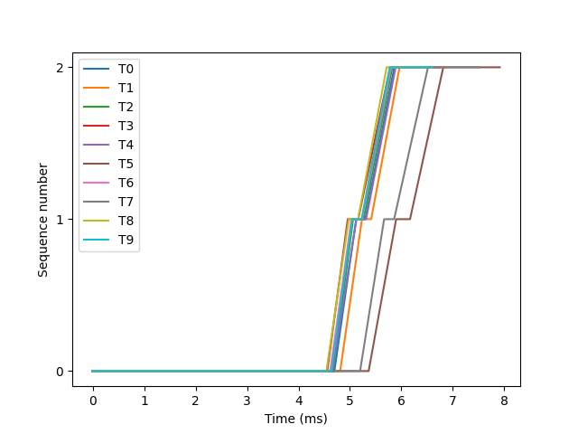 0.1 - 0.2 MB/s |  0.3 - 0.3 MB/s 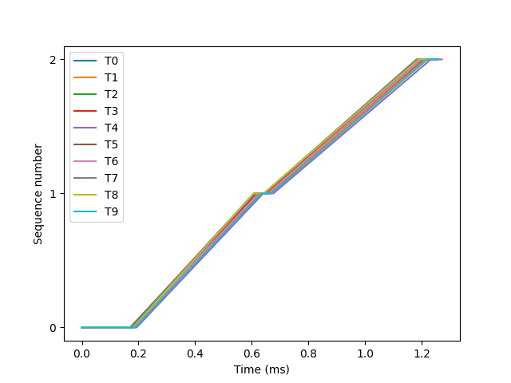 0.8 - 0.8 MB/s 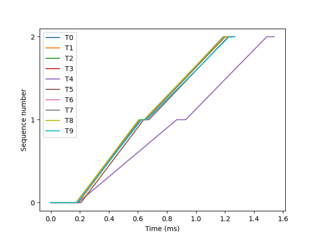 0.6 - 0.8 MB/s |

| Source | Target | Packetsize | Duration (sec) | Speed (MB/s) |
|:------:|:------:|:----------:|:--------------:|:------------:|
|  dart  |  java  |    100     |     1.98       |   0.1 - 0.1  |
|  dart  |  java  |    1400    |     1.97       |   0.1 - 0.1  |
|  dart  |  java  |   60000    |     1.98       |   0.1 - 0.1  |
|  dart  | python |    100     |     1.34       |   0.1 - 0.1  |
|  dart  | python |    1400    |     1.34       |   0.1 - 0.1  |
|  dart  | python |   60000    |     1.34       |   0.1 - 0.1  |
|  node  |  java  |    100     |     0.81       |   0.1 - 0.1  |
|  node  |  java  |    1400    |     0.81       |   0.1 - 0.2  |
|  node  |  java  |   60000    |     0.85       |   0.1 - 0.2  |
|  node  | python |    100     |     0.10       |   0.3 - 0.3  |
|  node  | python |    1400    |     0.10       |   0.8 - 0.8  |
|  node  | python |   60000    |     0.10       |   0.6 - 0.8  |
