# Messungen

| TX/RX | &nbsp;&nbsp;&nbsp;Java&nbsp;&nbsp;&nbsp; | Python |
:-------------------------:|:-------------------------:|:-------------------------:
| Dart | 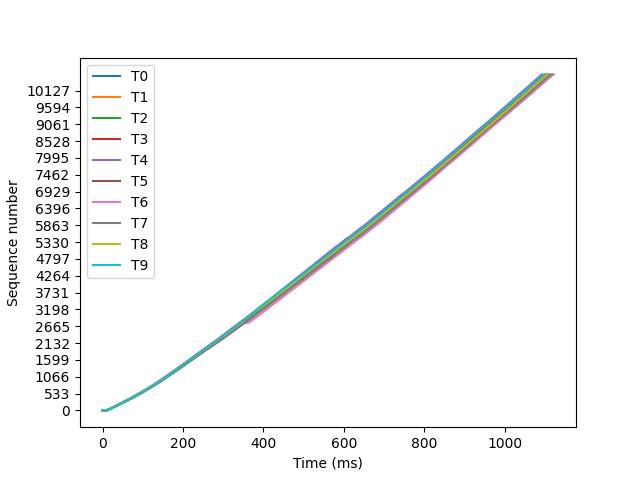 0.9 - 0.9 MB/s 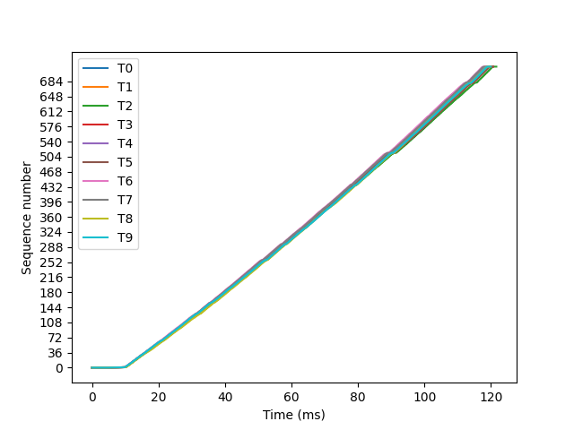 8.2 - 8.4 MB/s 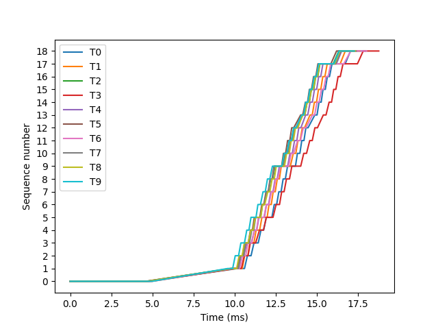 53.3 - 58.3 MB/s | 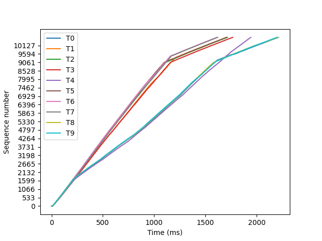 0.5 - 0.6 MB/s 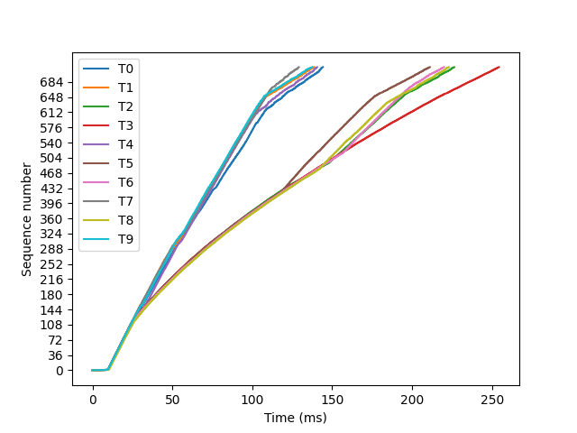 3.9 - 7.7 MB/s 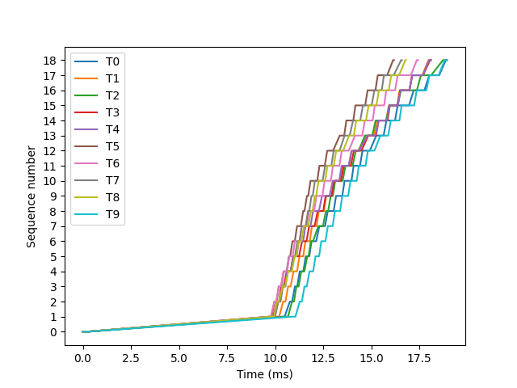 52.8 - 61.8 MB/s |
| Node | 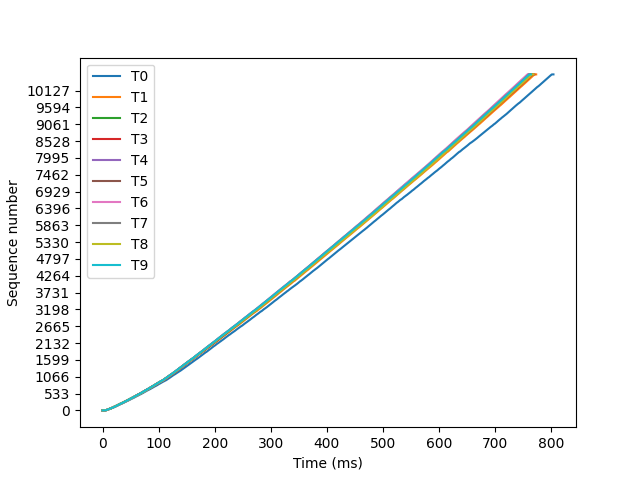 1.2 - 1.3 MB/s 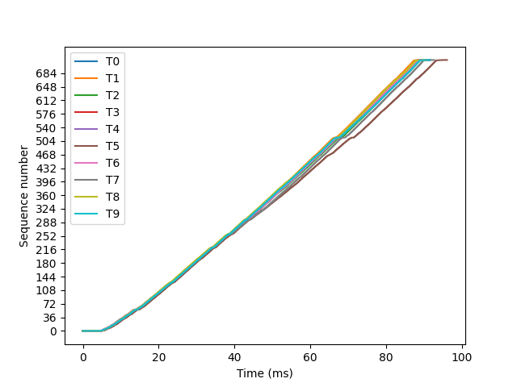 10.4 - 11.1 MB/s 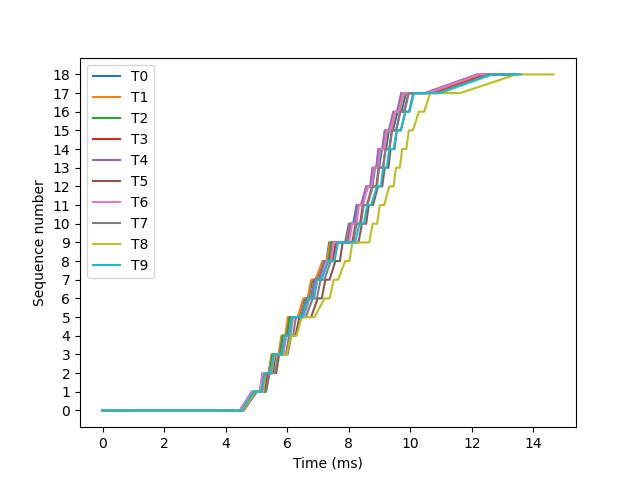 68.2 - 76.4 MB/s | 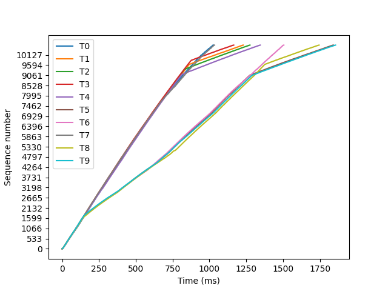 0.5 - 1.0 MB/s 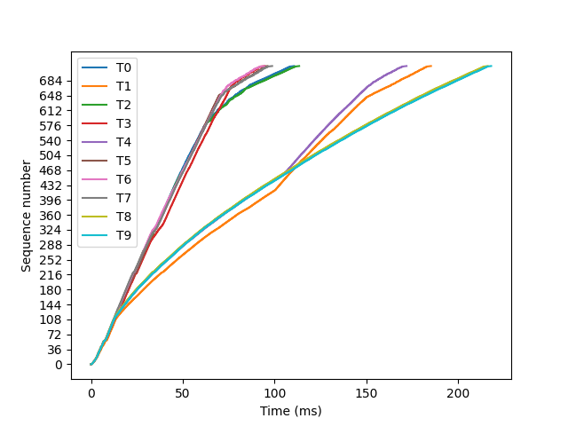 4.6 - 10.6 MB/s 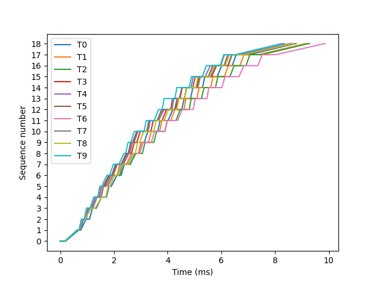 101.3 - 120.9 MB/s |

| Source | Target | Packetsize | Duration* (sec) | Speed (MB/s) |
|:------:|:------:|:----------:|:--------------:|:------------:|
|  dart  |  java  |    100     |     3.91       |   0.9 - 0.9  |
|  dart  |  java  |    1400    |     2.46       |   8.2 - 8.4  |
|  dart  |  java  |   60000    |     2.48       |  53.3 - 58.3 |
|  dart  | python |    100     |     4.15       |   0.5 - 0.6  |
|  dart  | python |    1400    |     1.84       |   3.9 - 7.7  |
|  dart  | python |   60000    |     1.84       |  52.8 - 61.8 |
|  node  |  java  |    100     |     2.47       |   1.2 - 1.3  |
|  node  |  java  |    1400    |     1.48       |  10.4 - 11.1 |
|  node  |  java  |   60000    |     1.32       |  68.2 - 76.4 |
|  node  | python |    100     |     2.61       |   0.5 - 1.0  |
|  node  | python |    1400    |     0.77       |   4.6 - 10.6 |
|  node  | python |   60000    |     0.60       | 101.3 - 120.9|

*Duration: Program runtime (start = TX start, end = RX end)