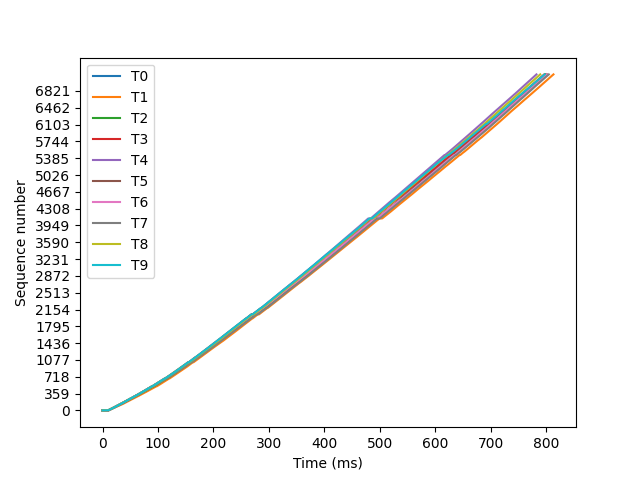
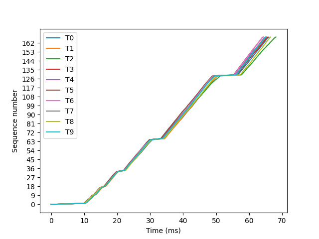
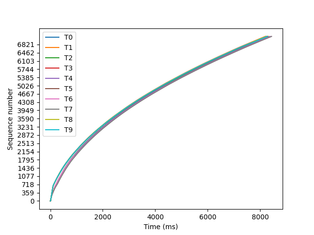
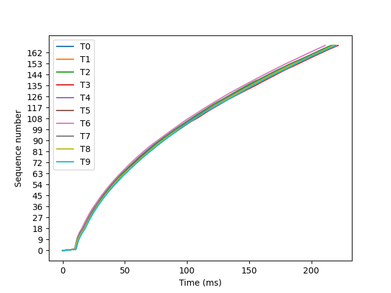
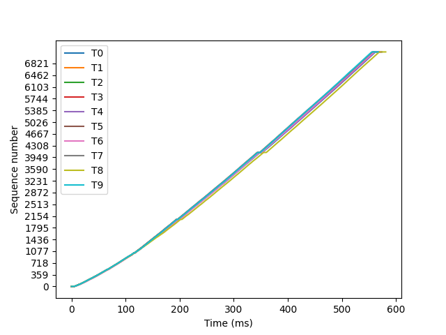
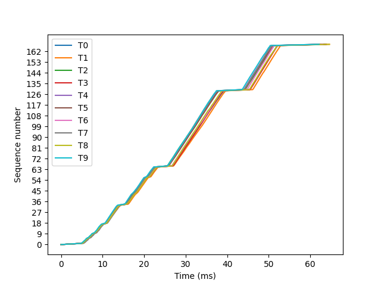
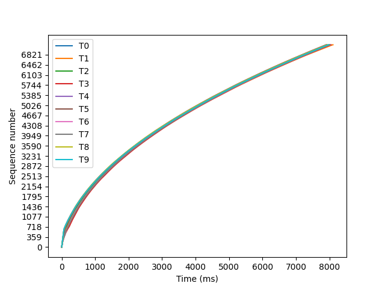
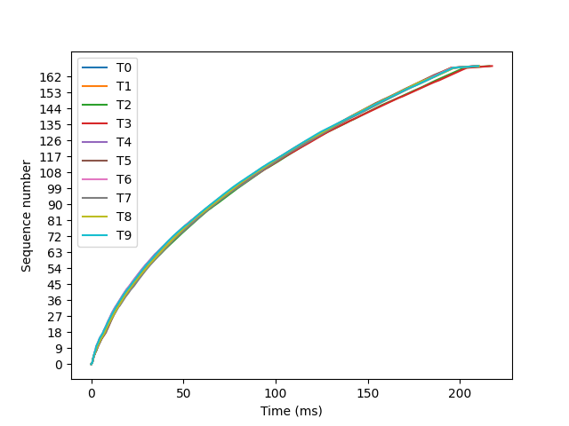

# Messungen

| TX/RX | Java | Python&nbsp;&nbsp;&nbsp; |
:-------------------------:|:-------------------------:|:-------------------------:
| Dart |  98.4 - 102.2 Mb/s  1174.9 - 1245.8 Mb/s |  9.5 - 9.8 Mb/s   361.1 - 379.0 Mb/s |
| Node |  137.8 - 141.2 Mb/s  1237.7 - 1288.1 Mb/s |  9.9 - 10.1 Mb/s  367.8 - 383.0 Mb/s |