# Messungen

| TX/RX | &nbsp;&nbsp;&nbsp;Java&nbsp;&nbsp;&nbsp; | Python |
:-------------------------:|:-------------------------:|:-------------------------:
| Dart | 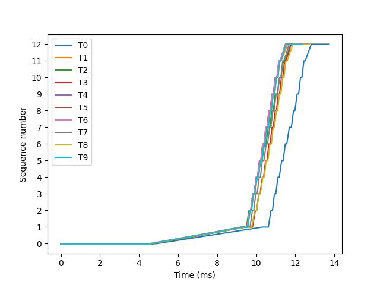 0.6 - 0.6 Mb/s 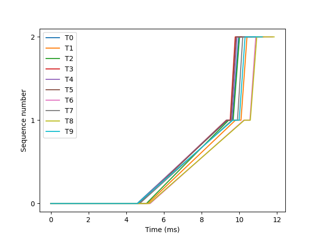 0.7 - 0.8 Mb/s 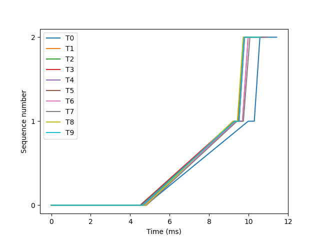 0.7 - 0.8 Mb/s | 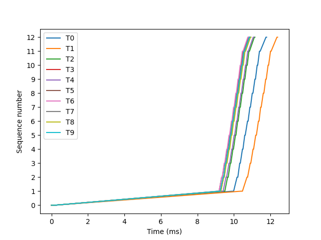 0.6 - 0.7 Mb/s 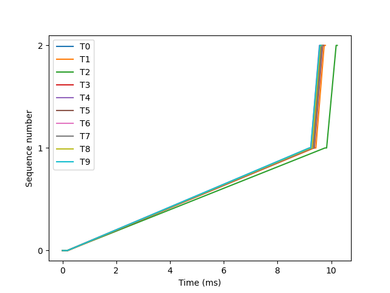 0.8 - 0.8 Mb/s 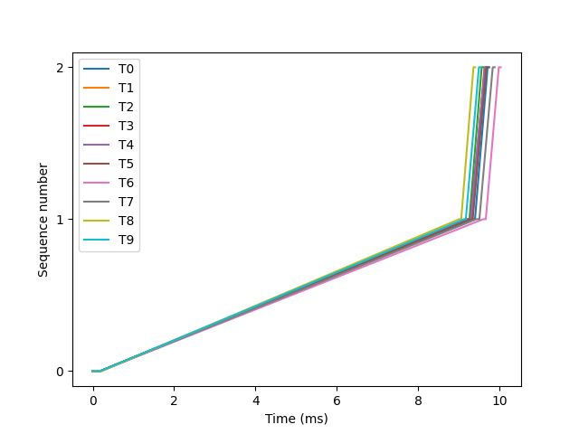 0.8 - 0.9 Mb/s |
| Node | 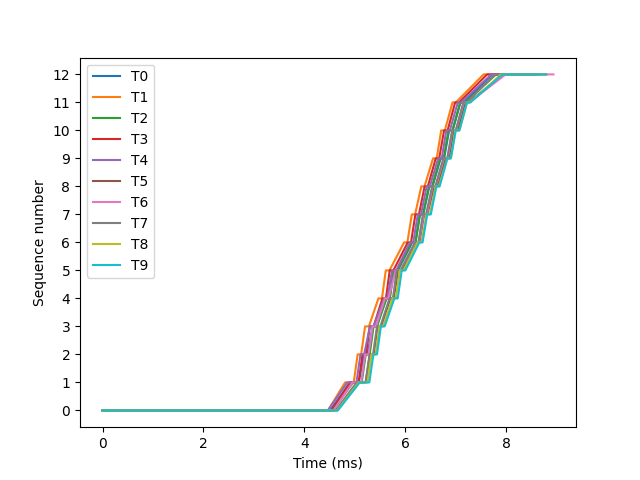 0.9 - 1.0 Mb/s 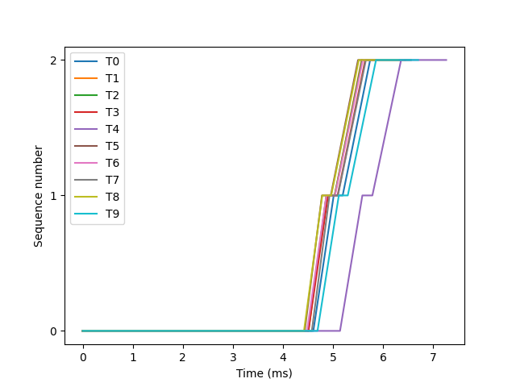 1.1 - 1.3 Mb/s 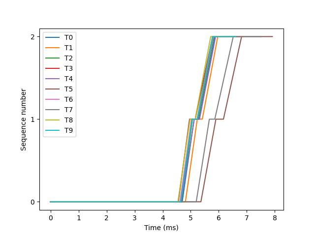 1.0 - 1.2 Mb/s | 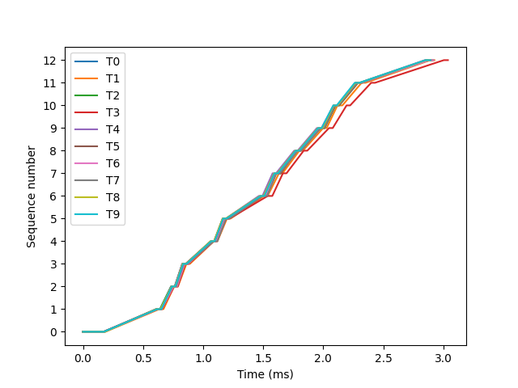 2.6 - 2.8 Mb/s 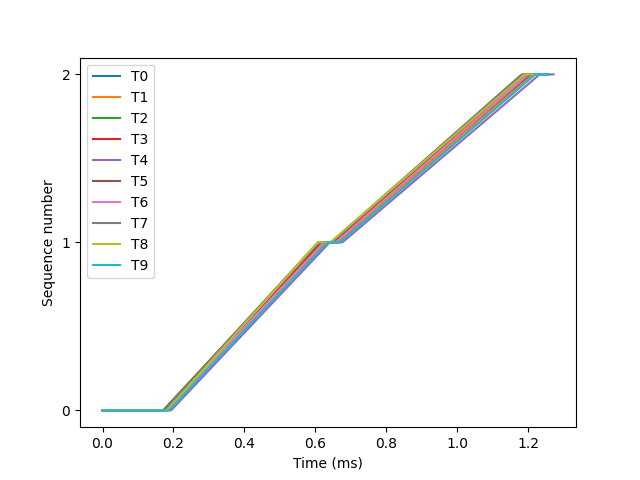 6.3 - 6.6 Mb/s 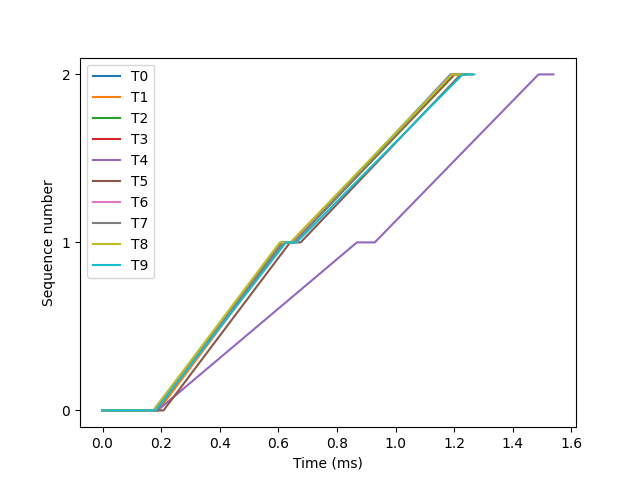 5.2 - 6.5 Mb/s |

| Source | Target | Packetsize | Duration (sec) | Speed (Mb/s) |
|:------:|:------:|:----------:|:--------------:|:------------:|
|  dart  |  java  |    100     |     1.98       |   0.6 - 0.6  |
|  dart  |  java  |    1400    |     1.97       |   0.7 - 0.8  |
|  dart  |  java  |   60000    |     1.98       |   0.7 - 0.8  |
|  dart  | python |    100     |     1.34       |   0.6 - 0.7  |
|  dart  | python |    1400    |     1.34       |   0.8 - 0.9  |
|  dart  | python |   60000    |     1.34       |   0.8 - 0.9  |
|  node  |  java  |    100     |     0.81       |   0.9 - 1.0  |
|  node  |  java  |    1400    |     0.81       |   1.1 - 1.3  |
|  node  |  java  |   60000    |     0.85       |   1.0 - 1.2  |
|  node  | python |    100     |     0.10       |   2.6 - 2.8  |
|  node  | python |    1400    |     0.10       |   6.3 - 6.6  |
|  node  | python |   60000    |     0.10       |   5.2 - 6.5  |
