# Messungen

| TX/RX | &nbsp;&nbsp;&nbsp;Java&nbsp;&nbsp;&nbsp; | Python |
:-------------------------:|:-------------------------:|:-------------------------:
| Dart | 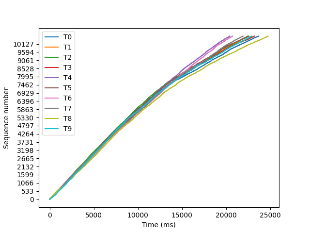 0.3 - 0.4 Mb/s 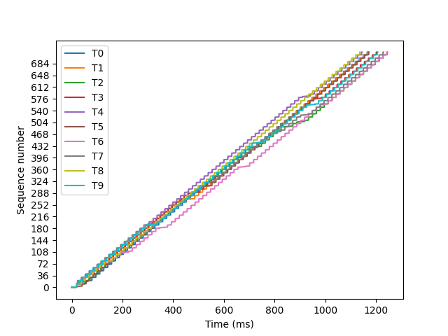 6.4 - 7.0 Mb/s 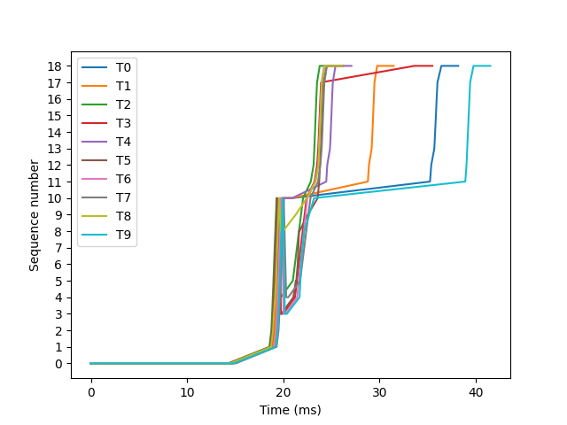 192.7 - 314.5 Mb/s | 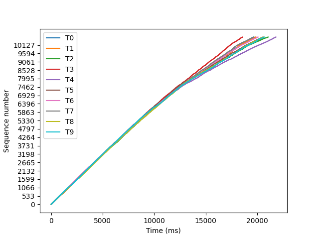 0.4 - 0.4 Mb/s 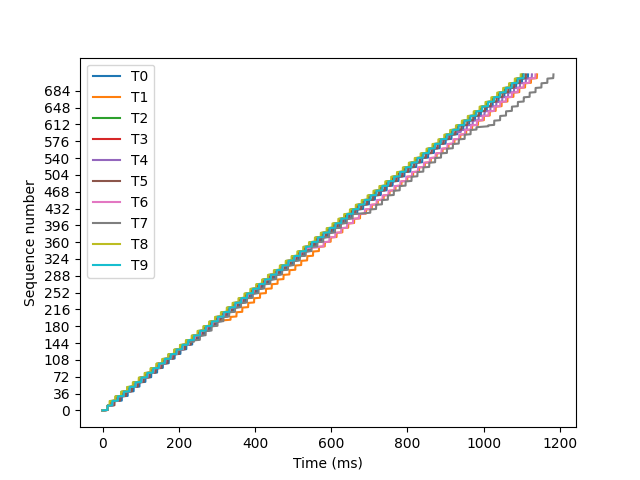 6.8 - 7.3 Mb/s 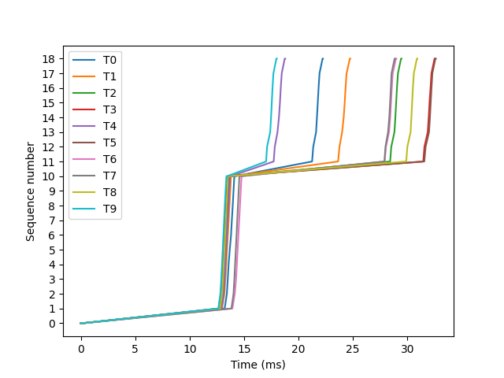 245.3 - 444.1 Mb/s |
| Node | 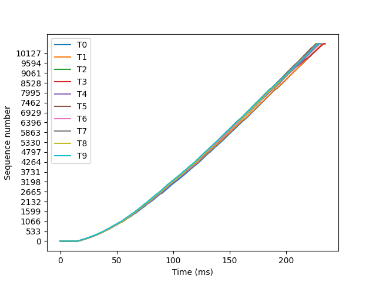 34.1 - 35.1 Mb/s 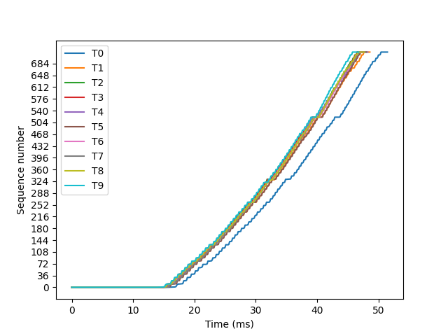 155.4 - 171.0 Mb/s 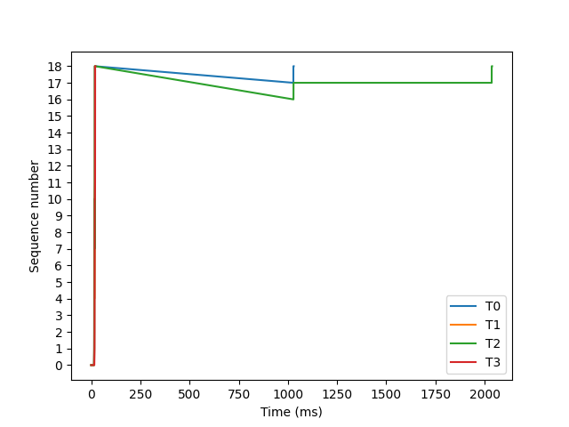 3.9 - 406.9 Mb/s | 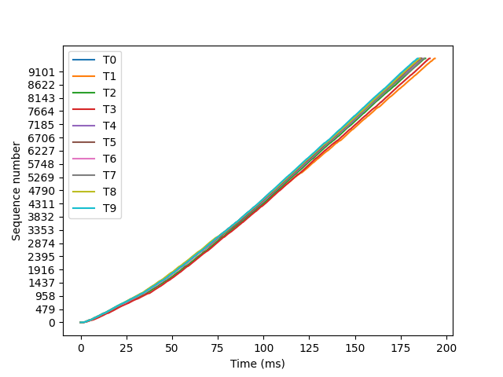 41.3 - 43.4 Mb/s 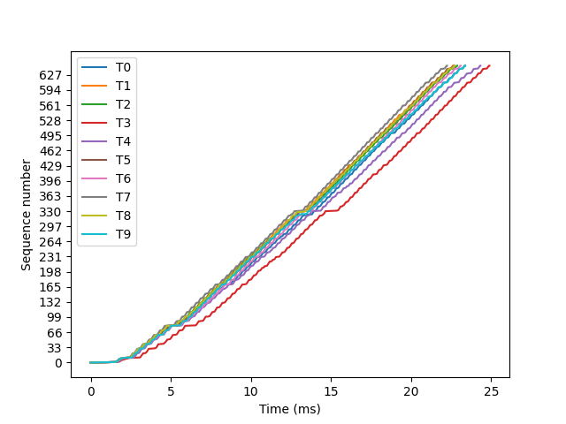 321.4 - 359.6 Mb/s 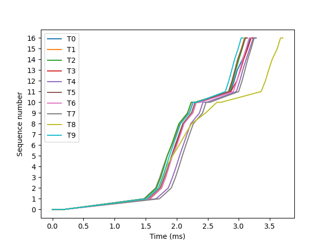 2157.4 - 2608.4 Mb/s |

| Source | Target | Packetsize | Duration* (sec) | Speed (MB/s) |
|:------:|:------:|:----------:|:---------------:|:------------:|
| dart   | java   | 100        | 41.73           | 0.3 - 0.4    |
| dart   | java   | 1400       | 3.43            | 6.4 - 7.0    |
| dart   | java   | 60000      | 2.01            | 192.7 - 314.5|
| dart   | python | 100        | 34.91           | 0.4 - 0.4    |
| dart   | python | 1400       | 2.62            | 6.8 - 7.3    |
| dart   | python | 60000      | 1.47            | 245.3 - 444.1|
| node   | java   | 100        | 1.10            | 34.1 - 35.1  |
| node   | java   | 1400       | 0.86            | 155.4 - 171.0|
| node   | java   | 60000      | 1.57            | 3.9 - 406.9  |
| node   | python | 100        | 0.37            | 41.3 - 43.4  |
| node   | python | 1400       | 0.10            | 321.4 - 359.6|
| node   | python | 60000      | 0.10            | 2157.4 - 2608.4|

*Duration: Program runtime (start = TX start, end = RX end)

