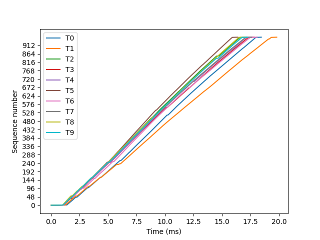
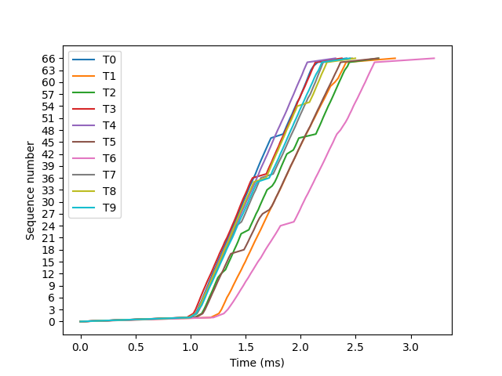
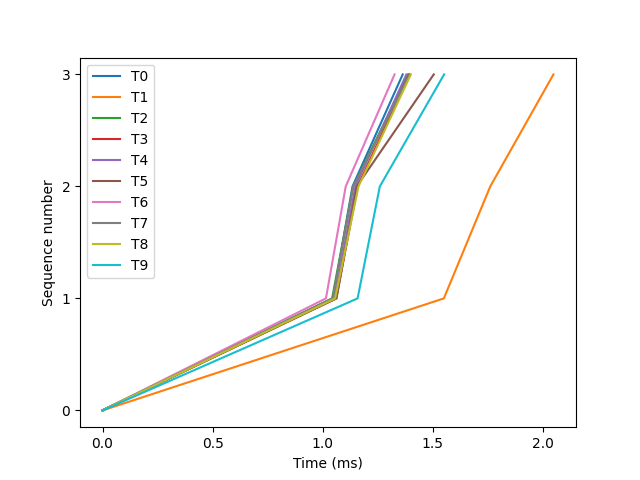
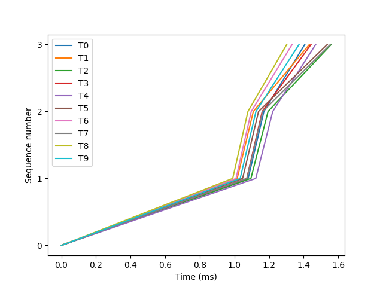
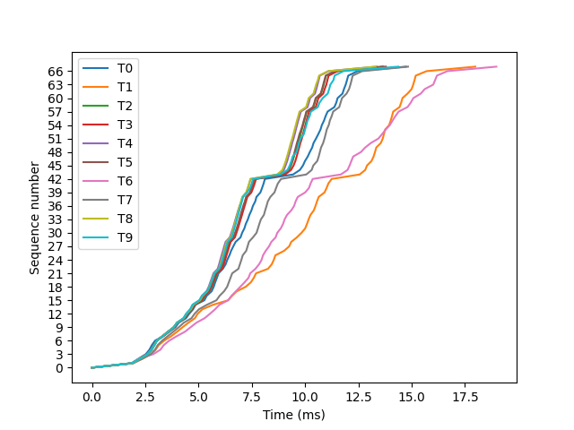

# Messungen

| TX/RX | &nbsp;&nbsp;&nbsp;Java&nbsp;&nbsp;&nbsp; | Python |
:-------------------------:|:-------------------------:|:-------------------------:
| Dart |  4,5 MB/s  30 MB/s  60 MB/s |  3,6 MB/s  22,5 MB/s  56,3 MB/s |
| Node |  1,2 MB/s  6 MB/s  15 MB/s |  0 MB/s  7,5 MB/s  18 MB/s |